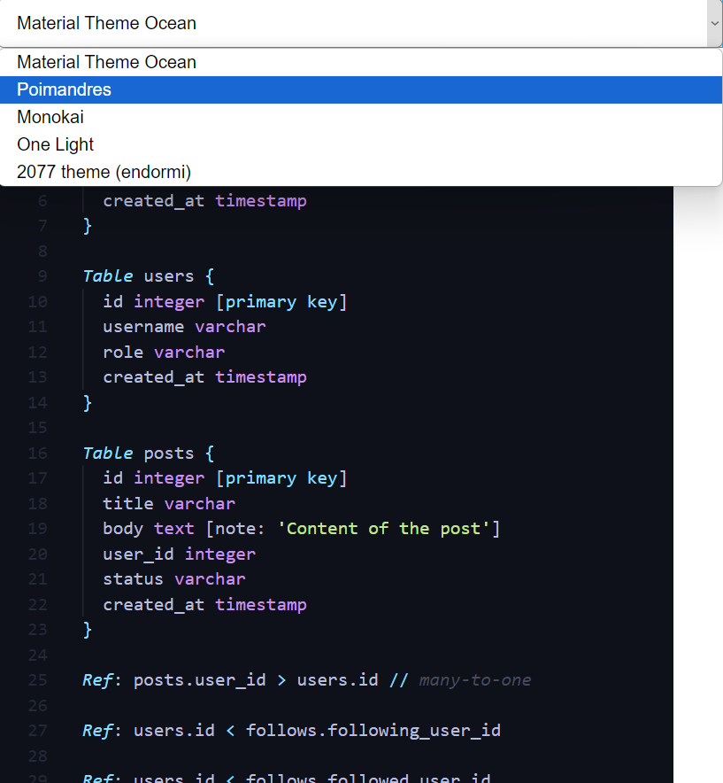

# monaco editor textmate theme loading example

## [⚡️ Play on Stackblitz](https://stackblitz.com/~/github.com/relliv/monaco-editor-textmate-theme-loading-example)

## 🌟 Preview

## 📚 References

- [DBML TextMate Schema Source](https://github.com/duynvu/DBML-Highlighter)
- [Collection of TextMate Grammars](https://github.com/shikijs/textmate-grammars-themes)

## 🌈 Import vscodethemes.com Themes

You can export https://vscodethemes.com/ themes and import into monaco editor. Just select any theme and open in web environment. Then press `F1` and run this command `@command:workbench.action.generateColorTheme`. VS Code exports current theme profile. And you can use this theme in this project.